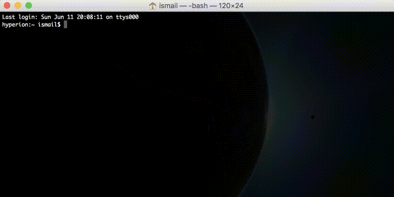

# myterminal

An all-day command-line companion

  

  

  

  

## What is it?

*myterminal* is designed to be a command-line application that would help you perform repetitive tasks that you do all day long with the press of a single programmable key. It tends to be an interactive command-line interface that you would (hopefully) keep running in a terminal window on your workstation to perform a set of programmed tasks and present them to the user in a nested manner.

## Features

* Configure long commands to be invoked with a single key-stroke
* Nest similar or related commands in a menu
* Specify parameters for commands
* Configure working directories for commands

## Installation

*myterminal* is available on *Npm*. You can install it globally with a simple command.

    npm install -g myterminal

## How to Use

Run `myterminal-cli` or simply `myterminal` from the command line passing it a path to a JSON configuration file as shown in the [examples](examples). For example, if the configuration file is stored at your home directory, you can run it as

    myterminal-cli ~/configs.json

*myterminal* will start and the rest should be simple.

You can also start *myterminal* without supplying the configuration file path, in which case it will start with a configuration file named *myterminal-configs.json* placed at your home (~/) directory. If the file does not exist, it will be created when the application is started for the first time.

## Dependencies

* prompt
* clear
* chalk
* fs-extra

## To-do

* Repeating tasks
